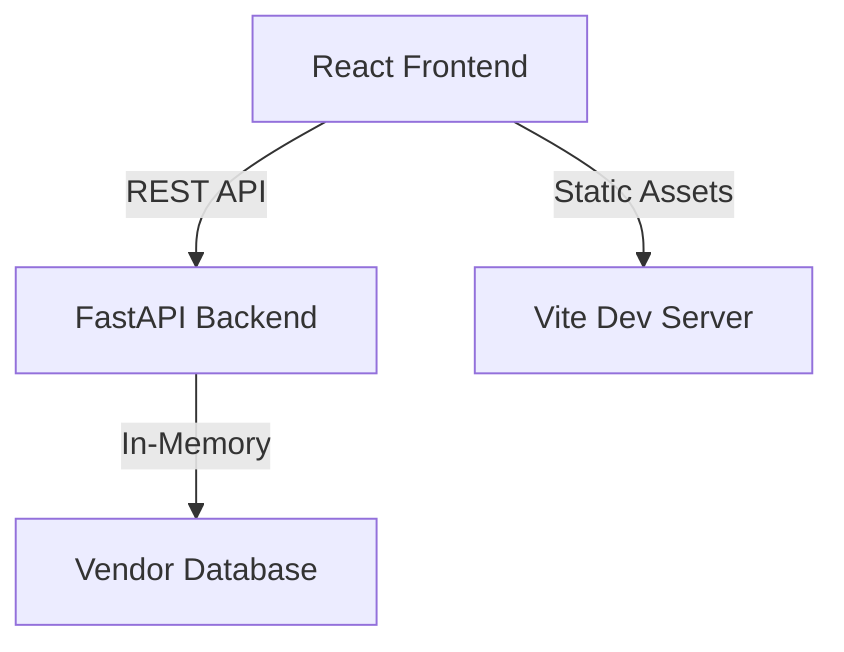

# 🚀 Vendor Onboarding Portal

[](https://github.com/udaysaini95/vendor-portal)
[](https://opensource.org/licenses/MIT)

A premium, full-stack solution for seamless vendor registration and management. Built with a focus on **Visual Excellence** and **Developer Experience**.

## ✨ Key Features

- **💎 Premium Design System**: Dark mode with glassmorphism, HSL-tailored colors, and smooth micro-animations.
- **⚡ High Performance**: Fast and lightweight frontend powered by Vite and React.
- **🛡️ Robust Backend**: FastAPI-based backend with automated validation and production-ready configuration.
- **📱 Fully Responsive**: Pixel-perfect layout that adapts to any screen size.
- **🚢 Deployment Ready**: Includes Docker configuration for one-click deployment.

---

## 🏗️ Architecture



---

## 🛠️ Tech Stack

### Frontend
- **React 18**: Component-based UI.
- **Vite**: Ultra-fast build tool and dev server.
- **TypeScript**: Type-safe development.
- **Vanilla CSS**: Custom design system with glassmorphism and animations.

### Backend
- **FastAPI**: High-performance Python API.
- **Pydantic**: Data validation and serialization.
- **Uvicorn**: ASGI server for production.

---

## 🚀 Getting Started

### Prerequisites
- Python 3.9+
- Node.js 20+
- Docker (Optional)

### Local Development

1. **Clone the repository**
   ```bash
   git clone https://github.com/udaysaini95/vendor-portal.git
   cd vendor-portal
   ```

2. **Setup Backend**
   ```bash
   cd backend
   pip install -r requirements.txt
   python main.py
   ```

3. **Setup Frontend**
   ```bash
   cd frontend
   npm install
   npm run dev
   ```

---

## 📦 Deployment

### Using Docker
The project is containerized for easy scaling and deployment.

```bash
docker build -t vendor-portal .
docker run -p 8000:8000 vendor-portal
```

### Environment Variables
| Variable | Description | Default |
|----------|-------------|---------|
| `PORT` | Backend port | `8000` |
| `ALLOWED_ORIGINS` | CORS allowed origins | `*` |
| `VITE_API_URL` | API Endpoint for Frontend | `http://localhost:8000` |

---

## 🎨 Design Philosophy
The Vendor Portal follows modern web design principles:
- **Depth**: Using blur and shadows to create a layered, "glassy" feel.
- **Glow**: Subtle neon highlights for interactive elements and status indicators.
- **Motion**: Staggered entrance animations and smooth hover transitions to guide user attention.

---

## 🤝 Contributing
Contributions are welcome! Please feel free to submit a Pull Request.

## 📄 License
This project is licensed under the MIT License.
